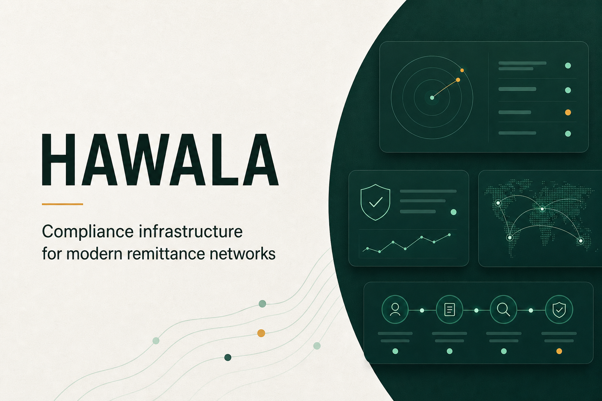

# HAWALA Compliance OS

> A bilingual compliance and operations platform for regulated institutions managing broker-led remittance networks.



HAWALA Compliance OS helps licensed remittance providers, exchange companies, banks, and supervised pilot programs create accountable digital records across customer onboarding, broker oversight, transaction monitoring, AML investigations, reconciliation, and regulatory evidence preparation.

This public repository contains a demonstration built with synthetic data. It shows the operating model honestly—it does not imply regulatory approval, live screening connectivity, or production funds movement.

## Why it exists

Broker-led remittance networks remain useful because they are fast, accessible, and relationship-driven. Their operational records, however, may be fragmented across paper, messaging applications, and spreadsheets. That makes compliance review, reconciliation, audit, and supervisory visibility difficult.

HAWALA Compliance OS demonstrates how a regulated institution could formalize those workflows while preserving accountable human decisions and the institution's existing legal responsibilities.

## Product capabilities

- Customer onboarding with minimized identity-document storage
- Broker due diligence, licensing metadata, beneficial-owner review, and corridor assignment
- Transfer recording with explainable risk indicators
- AML case management with evidence provenance, rule/model versions, analyst notes, and human overrides
- Human-approved suspicious-transaction-report preparation
- Broker prefunding, net-position calculation, reconciliation, settlement, and dispute records
- Privacy-aware supervisory and regulatory dashboards
- Administrator, Compliance Officer, Operator, and Auditor roles
- Attributed, durable operational and compliance audit events
- English and Arabic interfaces with right-to-left support
- Guided buyer demonstration and Jordan-first pilot command center

## Demonstration boundaries

| Capability | Demonstrated | External requirement for production |
|---|---|---|
| Sanctions and PEP screening | Synthetic fixture and provider-neutral adapter contract | Licensed data provider, credentials, SLA, and validation |
| Identity and KYB | Workflow and evidence states | Approved verification provider and lawful data schedule |
| Regulatory filing | Human-approved draft and simulated receipt | Authority-approved schema, channel, credentials, and process |
| Funds movement | Prefunding, exposure, reconciliation, and settlement records | Licensed sponsor, safeguarded accounts, and approved payment rail |
| Distributed ledger | Optional architectural proof | Multi-party governance case; not required for settlement |
| Security assurance | Application controls and readiness documentation | Buyer IAM, infrastructure evidence, and independent penetration test |

No live sanctions provider, identity vendor, payment rail, central-bank connection, or statutory-reporting channel is claimed by this project.

## Architecture

```text
English / Arabic web application
              |
      Server-authorized APIs
              |
  +-----------+------------+----------------+
  |           |            |                |
Customers  Transfers   Compliance       Broker operations
                          cases          and settlement
  |           |            |                |
  +-----------+------------+----------------+
              |
      Cloudflare D1 / Drizzle
              |
   Attributed audit-event stream
              |
  Provider-neutral external adapters
  (all simulated or disconnected here)
```

The operational database is the system of record. A distributed ledger is optional and is not treated as a substitute for safeguarding, payment execution, reconciliation, or regulatory permission.

## Technology

- React 19
- TypeScript
- Vinext / Vite
- Next-compatible application routing
- Cloudflare Workers and D1
- Drizzle ORM and migrations
- Workspace-provided identity with server-side role authorization

## Repository structure

```text
app/                  Product UI, authorization, and API routes
db/                   Drizzle schema and database access
drizzle/              Versioned D1 migrations
public/               Product assets
tests/                Safety-boundary checks
.openai/              Local Sites metadata (ignored by Git)
.github/              Dependency updates and security checks
```

## Run locally

### Requirements

- Node.js 22.13 or newer
- pnpm or npm
- Linux, macOS, or Fedora/Ubuntu under WSL recommended

### Installation

```bash
git clone https://github.com/006ZERO/Hawala.git
cd Hawala
pnpm install
pnpm dev
```

Build the production bundle:

```bash
pnpm build
```

Generate a migration after changing `db/schema.ts`:

```bash
pnpm db:generate
```

Local Sites deployments may create `.openai/hosting.json`. That directory is intentionally ignored because it contains workspace-specific hosting metadata. The local build falls back to the portable `DB` binding when the file is absent.

## Application roles

| Role | Principal responsibilities |
|---|---|
| Administrator | Configuration, access provisioning, broker onboarding, filing, and settlement authority |
| Compliance Officer | Due diligence, case decisions, overrides, and filing preparation |
| Operator | Transfer operations, approved settlement actions, and operational exceptions |
| Auditor | Read-only access to records, decisions, and attributed evidence |

For a new database, set `HAWALA_BOOTSTRAP_ADMIN_EMAIL` to the exact email address of the initial Administrator before that person signs in. No user receives Administrator access automatically when this variable is absent. Production deployments require buyer-managed identity, MFA, provisioning, deprovisioning, and periodic access reviews.

## API surfaces

- `GET/POST /api/customers`
- `GET/POST /api/transfers`
- `GET/PATCH /api/cases`
- `GET/POST /api/operations`
- `GET /api/integrations/status`
- `POST /api/integrations/screening`

The screening endpoint is deliberately synthetic. Its response identifies the simulation environment, confirms that nothing was transmitted externally, and includes limitations suitable for audit evidence.

## Status

This project is a buyer-ready demonstration and pilot-planning asset—not a production remittance service.

Before controlled live use, the project requires at minimum:

- A licensed and accountable sponsor
- Qualified Jordanian legal review
- The applicable Central Bank of Jordan pathway
- Contracted screening and identity providers
- Approved safeguarding and payment arrangements
- Buyer-controlled IAM, security infrastructure, and data governance
- Independent penetration testing
- An authorized shadow pilot with measurable results

## Legal and compliance notice

This repository does not provide legal advice and does not represent approval, endorsement, licensing, certification, or authorization by the Central Bank of Jordan or any other authority. All names, transactions, alerts, brokers, balances, receipts, matches, and performance values in the demonstration are synthetic or illustrative unless governed by a separately approved pilot data schedule.

Do not use the demonstration for real customer decisions, sanctions screening, regulatory filing, funds movement, or production compliance conclusions.

## Security

Please report vulnerabilities privately as described in [`SECURITY.md`](SECURITY.md). Automated checks scan dependencies, source history, linting, and rendered output on pull requests and on a weekly schedule.

## Licensing

This repository is public for evaluation and portfolio visibility, but no open-source license is granted. Copyright remains with the repository owner; copying, redistribution, modification, deployment, or commercial use requires written permission.
